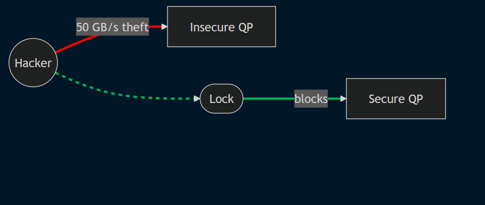

# Lesson Plan: Exploring 400G RoCEv2 and Cybersecurity with SoftRoCE on Azure

**Objective**: Simulate RDMA over Converged Ethernet (RoCEv2) in 400G switch contexts, set up Azure VMs to test Queue Pairs, and assess security risks

**Target Audience**: Security, HPC Newcomers

**Duration**: 2.5 hours (30 min for Azure/VM setup, 2 hours for lab).

**Materials Needed**:
- Laptop with internet and Azure account
- 
- Azure Portal access ([portal.azure.com](https://portal.azure.com)).
- Canva ([canva.com](https://canva.com)) or PowerPoint for diagrams.
- Snipping Tool (Windows: Win+Shift+S) or Screenshot (Mac: Cmd+Shift+4).

**Lesson Overview**: Configure two Azure VMs, simulate a 400G RoCEv2 environment with SoftRoCE, test Queue Pairs, and explore cybersecurity risks. Learn why this niche skill is critical for AI/HPC careers!


## Step-by-Step Instructions

### 1. Set Up Azure Account (10 min)
- Sign into Azure Portal ([portal.azure.com](https://portal.azure.com)) with student credits or trial.
- Create a Resource Group (e.g., “RoCE-Lab”).
- **Tip**: Use Azure for Students ($100 credit) to avoid costs.
- **Visual**: Add Azure logo (download from [azure.microsoft.com](https://azure.microsoft.com), resize to 100x100px).

### 2. Deploy Two Azure VMs (20 min)
- In Azure Portal, create two VMs:
  - **Name**: VM1, VM2.
  - **Region**: East US (same for both).
  - **Image**: Ubuntu Server 22.04 LTS.
  - **Size**: Standard_D2s_v5 (2 vCPUs, 8GB RAM, ~$0.10/hour).
  - **Authentication**: Username “student,” password “pass123.”
  - **Disk**: 30GB SSD.
- **Network**: Create a VNet (“roce-vnet,” 192.168.1.0/24, subnet “default”). Assign: VM1 = 192.168.1.10, VM2 = 192.168.1.11.
- **NSG**: Allow TCP/UDP (all ports) between VMs, allow SSH (port 22) from your IP.
- SSH into VMs (`ssh student@<public_IP>`), verify: `ping 192.168.1.11` from VM1.
- **Visual**: (VNet or NSG).

### 3. Install RDMA Tools (10 min)
- Run:
  ```bash
  sudo apt update && sudo apt install -y rdma-core libibverbs-dev librdmacm-dev iproute2 perftest


  ## 4. Configure SoftRoCE (10 min)

- **Start**:  
  ```bash
  sudo rxe_cfg start 
- **Bind Interface**  
  ```bash
   sudo rxe_cfg add eth0
- **Verify Status**  
  ```bash
  rxe_cfg status
  ibv_devinfo


### 5. Test RoCE with Queue Pairs (15 min)
- On VM1, start RDMA server: `ib_write_bw -a`.
- On VM2, connect as client: `ib_write_bw -a 192.168.1.10`. Note bandwidth output (e.g., ~10 Gbps due to VM limits).
- Explain: “400G switches achieve 50 GB/s per port, but E2E rates in our lab are lower due to Azure’s virtual NICs and CPU constraints, simulating real-world bottlenecks like PCIe Gen4.”


  - **Creation**: Run `ib_write_bw` on VM2, capture terminal when bandwidth stats appear using Snipping Tool (Windows: Win+Shift+S) or Screenshot (Mac: Cmd+Shift+4). Save as PNG.
- 
### 6. Run a Sample QP Script (15 min)
- Create a file named `rdma_test.c` on both VMs with the following code:
  ```c
  #include <stdio.h>
  #include <infiniband/verbs.h>
  int main() {
      struct ibv_device **dev_list = ibv_get_device_list(NULL);
      if (!dev_list) { printf("No RDMA devices!\n"); return 1; }
      struct ibv_context *ctx = ibv_open_device(dev_list[0]);
      if (!ctx) { printf("Failed to open device!\n"); return 1; }
      struct ibv_pd *pd = ibv_alloc_pd(ctx);
      char *buffer = malloc(1024);
      struct ibv_mr *mr = ibv_reg_mr(pd, buffer, 1024, IBV_ACCESS_LOCAL_WRITE);
      if (!mr) { printf("Memory registration failed!\n"); return 1; }
      printf("Secure memory registered for 400G RoCEv2 QP!\n");
      ibv_dereg_mr(mr); free(buffer); ibv_dealloc_pd(pd); ibv_close_device(ctx); ibv_free_device_list(dev_list);
      return 0;
  }

- Compile: gcc -o rdma_test rdma_test.c -libverbs.
- Run: ./rdma_test.
### 7. Cybersecurity Scenarios (35 min)
- **Scenario 1: Unauthorized Memory Read**
  - Edit `rdma_test.c` from Step 6, remove `IBV_ACCESS_LOCAL_WRITE` from the `ibv_reg_mr` call (e.g., set permissions to `0` or `IBV_ACCESS_REMOTE_READ`). Recompile: `gcc -o rdma_test rdma_test.c -libverbs`. Run: `./rdma_test` on both VMs.
  - On VM2, attempt an RDMA read: `ib_read_lat`. If it succeeds, say: “We stole VM1’s data because the Queue Pair’s memory wasn’t protected!”
  - Fix: Restore `IBV_ACCESS_LOCAL_WRITE` in `rdma_test.c`, recompile, rerun. Confirm `ib_read_lat` fails.
- **Scenario 2: Packet Sniffing**
  - Install packet capture tool: `sudo apt install -y tcpdump`.
  - On VM2, run: `sudo tcpdump -i eth0`. On VM1, send data with `ib_write_bw -a`. Show captured packets in `tcpdump` output.
  - Fix: Install OpenVPN: `sudo apt install -y openvpn`. Set up a VPN tunnel between VMs (use a simple config, e.g., from OpenVPN docs). Rerun `ib_write_bw` and verify `tcpdump` shows no clear data.
- **Scenario 3: Rogue Client Access**
  - Create a third VM (VM3) in the same VNet (5 min, same setup as VM1: Ubuntu 22.04, Standard_D2s_v5, IP 192.168.1.12).
  - On VM3, install `perftest` (`sudo apt install -y perftest`) and try: `ib_write_bw -a 192.168.1.10`. If it connects to VM1, it’s a security breach.
  - Fix: In Azure Portal, update the Network Security Group (NSG) to block VM3’s IP (deny TCP/UDP from 192.168.1.12 to 192.168.1.10/11). Rerun and confirm failure.
- **Scenario 4: Denial of Service**
  - On VM2, flood VM1 with RDMA requests: `while true; do ib_write_lat 192.168.1.10; done`.
  - On VM1, run `ib_write_bw -a` and check for performance degradation (lower bandwidth).
  - Fix: Simulate rate-limiting with traffic control: `sudo tc qdisc add dev eth0 root tbf rate 100mbit burst 32kbit latency 400ms`. Rerun and note improved stability.
- **Scenario 5: Memory Overwrite Attack**
  - Edit `rdma_test.c`, change `ibv_reg_mr` to allow `IBV_ACCESS_REMOTE_WRITE` (e.g., `IBV_ACCESS_LOCAL_WRITE | IBV_ACCESS_REMOTE_WRITE`). Recompile, run.
  - On VM2, use `ib_write_lat` to overwrite VM1’s memory buffer. Check for data corruption (e.g., inspect buffer content if modified in script).
  - Fix: Restrict to `IBV_ACCESS_LOCAL_WRITE` only, recompile, rerun. Confirm overwrite fails.
- **Scenario 6: 400G Data Theft**
  - Run `ib_write_bw` with an unrestricted QP (modify `rdma_test.c` to skip `ibv_reg_mr` protections or use `IBV_ACCESS_REMOTE_READ`). Discuss: “A 400G switch could enable 50 GB/s data theft if QPs are unsecured, critical in AI data centers!”
  - Fix: Reapply `ibv_reg_mr` with `IBV_ACCESS_LOCAL_WRITE`, recompile, run. In Azure Portal, add an NSG rule to restrict traffic to VM1/VM2 IPs (192.168.1.10/11). Verify security.
  - 


